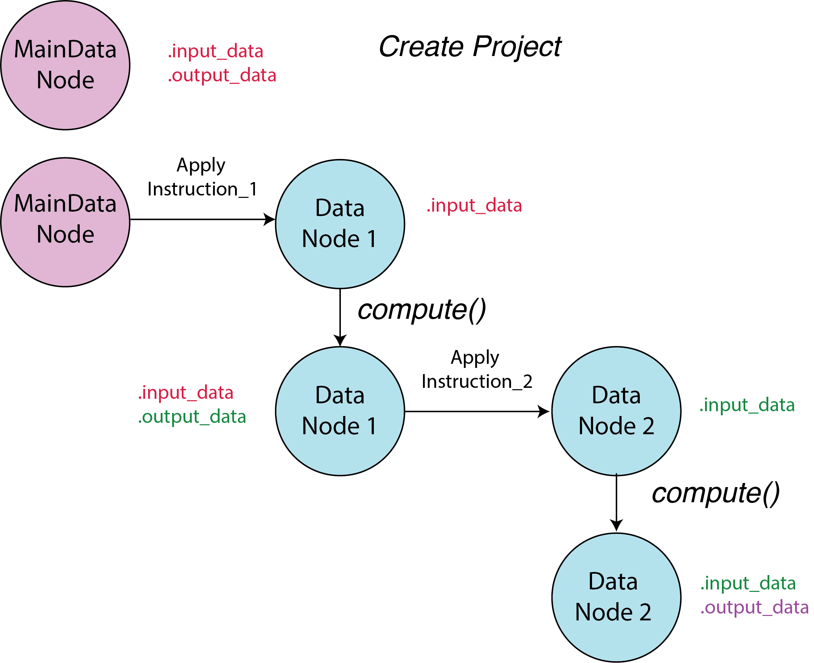

.. _data_node:

Data Node
=========

Each project in the system has a unique main data node (MainDataNode) that serves as the entry point for the project's data. Whenever an instruction is applied to the main data node, a new data node (DataNode) object is created. By applying instructions on existing data nodes, new data nodes can be generated. 

The newly generated data node is considered a "lazy" node, meaning it is not evaluated until it is needed. To force the evaluation of a data node, users can use the `.compute()` method. However, since no instructions are applied to the main data node, it does not have a `.compute()` method.

The parent node's output data is the descendant node's input data. Lazy nodes do not have any output data; as a result, users need to compute them before applying instructions to them.

User can have access to data inside the node by `.access_input_data()` and `.access_output_data()` methods. The former returns the input data of the node, while the latter returns the output data of the node.

At a data node, one can see the history of instrucions from the root node (MainDataNode) to the current node by using `.history()` command. The decendents of the current node can be accessed by `.decendents()` method.