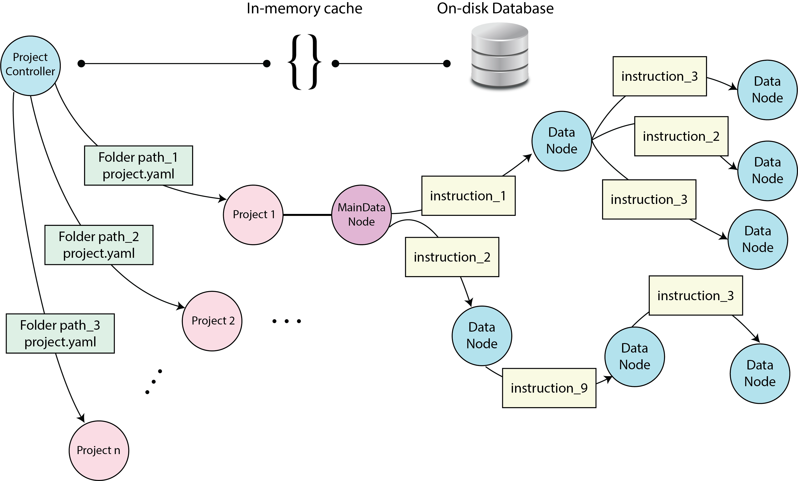

nsaphx
======

.. image:: https://img.shields.io/pypi/l/nsaphx.svg
    :target: https://pypi.org/project/nsaphx
    :alt: licence

.. image:: https://github.com/nsaph-software/nsaphx/workflows/Python\ package/badge.svg?branch=develop&event=push
    :target: https://github.com/nsaph-software/nsaphx/actions
    :alt: Test Status

.. image:: https://img.shields.io/pypi/v/nsaphx.svg
    :target: https://pypi.org/project/nsaphx
    :alt: PyPI version

.. image:: https://img.shields.io/github/issues/nsaph-software/nsaphx
    :target: https://pypi.org/project/nsaphx
    :alt: issues

.. image:: https://codecov.io/gh/NSAPH-Software/nsaphx/branch/develop/graph/badge.svg?token=8aSueNmHZN 
    :target: https://codecov.io/gh/NSAPH-Software/nsaphx
    :alt: codecov

*Reproducible Causal Inference Studies*

|

The nsaphx Python package is designed to support causal inference studies using the potential outcome framework. It offers a flexible and extensible framework for defining and applying computational instructions to input data, including exposure, outcome, and confounders. The package uses directed acyclic graphs and database storage for efficient computation and storage of each object.

The instruction handlers in the package can be easily extended by defining new classes and methods, enabling users to create new instructions that can be applied to data. Each object is computed only once and stored in the database to prevent duplication of data and ensure efficiency.

At the core of the package is the project controller (PC), which is based on a connected database. The PC can retrieve previously computed projects or add new ones, and can manage zero or more projects. Each project is defined by a connection to a project folder containing a project.yaml file.

All projects have a main data node that is automatically generated, and users can apply instructions to this data node or access it directly. When an instruction is applied to the main data node, a new data node is generated. Instructions can be chained together and applied to both the main data node and ordinary data nodes.

The data nodes are lazy and only computed when necessary. To compute the results, users must use the compute() method.

.. toctree::
   :glob:
   :maxdepth: 2
   :caption: Introduction

   about

.. toctree::
   :glob:
   :maxdepth: 2
   :caption: Researchers

   setup_env
   quickstart
   plugins
   data_node
   faq

.. toctree::
   :glob:
   :maxdepth: 2
   :caption: Developers

   setup_env_dev
   documentation
   git_branching
   how_to_add_plugin
   modules

.. toctree::
   :glob:
   :maxdepth: 2
   :caption: Community
   
   contact
   CHANGELOG.md

Indices and tables
==================

* :ref:`genindex`
* :ref:`modindex`
* :ref:`search`
